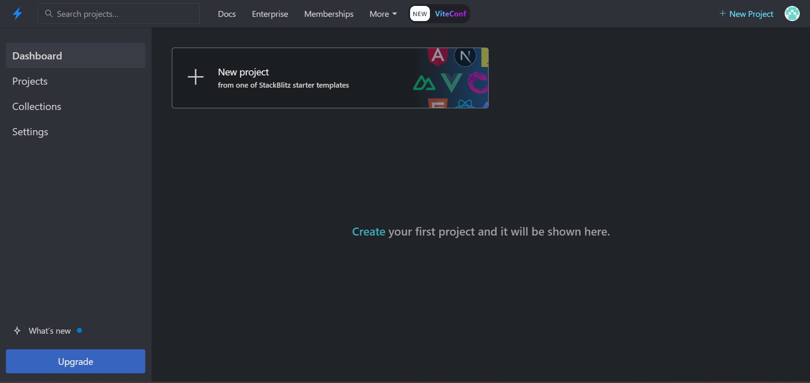
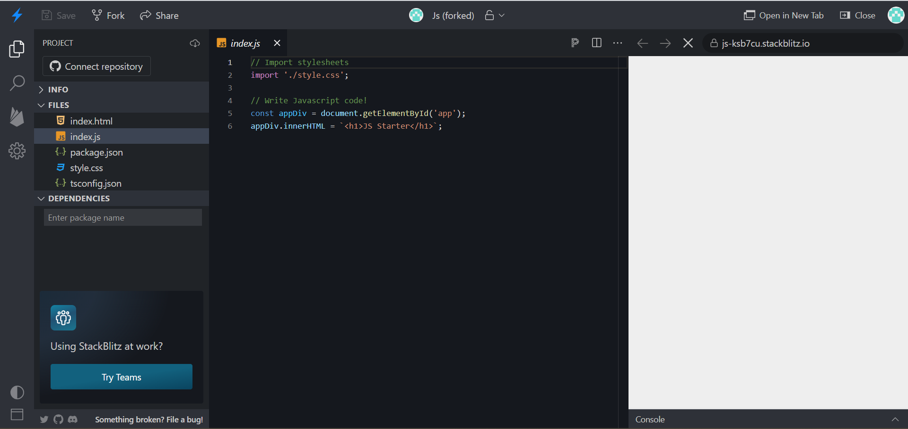

# Tarea 1.3. Navegadores y herramientas de desarrollo

### Daniel Marín López

Entrega en este repositorio de GitHub Classroom:

1. Qué es un navegador y su relación con el servidor web (HTTP).
2. Indica cuál es el funcionamiento básico de un navegador.
3. Indica qué es Flash y su relación con los navegadores actuales.
4. Indica qué es un applet y su relación con los navegadores actuales.
5. Qué es el motor de renderizado (render engine) en un navegador. Indica los más destacados en la actualidad y asócialos a cada navegador.
6. Qué es el intérprete de JavaScript (JavaScript engine) en un navegador. Indica los más destacados en la actualidad y asócialos a su navegador.
7. El mismo código JavaScript va a ser ejecutado en distintos navegadores. Explica las particularidades de la programación de guiones y sus ventajas y desventajas sobre la programación tradicional.
8.  Firefox Quantum. Averigua qué es y destaca alguna de sus ventajas.
9.  Chrome Dev Tools, Chrome Canary y Timeline. Averigua qué son.
10.  Stackblitz. Averigua qué es y crea un primer proyecto en él. Indica qué ventajas tiene.

Referencias:
*   [El adiós de Flash en Chrome llega en 2020](https://www.elconfidencial.com/tecnologia/2019-09-04/flash-player-chrome-adios-prohibido-html5_2207391/)  
    
*   [Ayuda de Google Chrome: Utilizar audio y vídeo Flash y solucionar problemas de este contenido](https://support.google.com/chrome/answer/6258784?hl=es&visit_id=637049995233363453-831003547&rd=1)  
    
*   [Java y el explorador Google Chrome](https://www.java.com/es/download/faq/chrome.xml)  
    
*   [¿Cómo puedo activar Java en el explorador web?](https://www.java.com/es/download/help/enable_browser.xml)
*   [Comparativa de motores de renderizado](https://es.wikipedia.org/wiki/Anexo:Comparativa_de_motores_de_renderizado)  
    
*   [Navega por el lado más salvaje.](https://www.mozilla.org/es-ES/firefox/channel/desktop/)  
    
*   [stackoverflow survey  2023 development environments and tools](https://survey.stackoverflow.co/2023/#most-popular-technologies-new-collab-tools "https://survey.stackoverflow.co/2023/#most-popular-technologies-new-collab-tools")  
    
*   [Qué es SRE y en qué se parece (y diferencia) de DevOps](https://discoverthenew.ituser.es/devops/2019/02/que-es-sre-y-en-que-se-parece-y-diferencia-de-devops)
*   [Stackblitz](https://www.bravent.net/stackblitz-ide-nube-crear-aplicaciones-web)  
    
*   [FF developer](https://www.mozilla.org/es-ES/firefox/developer/)  
    
*   C[hrome devtools](https://developers.google.com/web/tools/chrome-devtools/?hl=es)  
    
*   [How to analyzing page speed in chrome dev tools](https://stackoverflow.com/questions/31729240/how-to-analyzing-page-speed-in-chrome-dev-tools)  
    
*   [DOMContentLoaded](http://web.archive.org/web/20150405114023/http://ie.microsoft.com/testdrive/HTML5/DOMContentLoaded/Default.html)
--------------------------------

### Qué es un navegador y su relación con el servidor web (HTTP).

Un navegador es un programa conocido como **cliente** que junto con un **servidor** hacen la estructura **cliente-servidor**.

1. Cuando un usuario quiere ver una página web, este la debe hacer a través de internet (protocolo **HTTP**). El navegador busca la IP bien por el **Sistema de Nombres de Dominio** (DNS) o la **caché**.
2. El servidor recibe la petición y la acepta.
3. El servidor devuelve los archivos al navegador para que los visualice el usuario.

[Enlace de referencia](https://www.hostinger.es/tutoriales/que-es-un-servidor-web#:~:text=El%20navegador%20busca%20la%20direcci%C3%B3n,alojan%20los%20archivos%20del%20sitio.)

### Indica cuál es el funcionamiento básico de un navegador.

El navegador lo que hace es devolver la información de un servidor y mostrarla al usuario que mandó la petición a dicho servidor.

### Indica qué es Flash y su relación con los navegadores actuales.

**Flash** era un software (applet) que estaba en los navegadores que permitía crear animaciones, videojuegos, etc. Pero debido a que era demasiado pesado, inseguro, no portable a móviles e innecesario, los navegadores optaron por eliminarlo de su software para que tanto usuarios como páginas web se adaptaran a dejar atrás esta tecnología para 2020.

### Indica qué es un applet y su relación con los navegadores actuales.

Un **applet** es un programa que ejecuta otro programa según el contexto. Carece de ejecución independiente, de sesión y tiene privilegios restringidos, pero ofrece información gráfica y a veces interactúa con el usuario.

Su relación con los navegadores es la misma que ***Flash***, sirven para ofrecer contenido multimedia y son dependientes de otro programa (como un navegador).

[Enlace de referencia](https://es.wikipedia.org/wiki/Applet)

### Qué es el motor de renderizado (render engine) en un navegador. Indica los más destacados en la actualidad y asócialos a cada navegador.

Un **motor de renderizado** es un software de un navegador web, su función es transformar los documentos HTML y otos recursos para hacer una representación visual e interactiva al usuario.

Algunos motores de renderizado son:

|Motor|Estado|Desarrollador|Licencia|Incluido en|
|--|--|--|--|--|
|Webkit|Activo|Apple|GNU LGPL, BSD|Safari, y todos los navegadores de la App Store|
|Blink|Activo|Google|GNU LGPL, BSD|Google Chrome y todos los navegadores basados en Chromium, como Microsoft Edge, Brave y Opera|
|Gecko|Activo|Mozilla|MPL|Mozilla Firefox y el cliente de correo Mozilla Thunderbird, además de las bifurcaciones como SeaMonkey, Waterfox y Icecat|
|Goanna|Activo|M. C. Straver|GNU LGPL, BSD|Pale Moon y Basilisk|
|NetSurf|Activo|hobbyists|GNU GPLv2|NetSurf|

### Qué es el intérprete de JavaScript (JavaScript engine) en un navegador. Indica los más destacados en la actualidad y asócialos a su navegador.

Un **intérprete de JavaScript** es un software que interpreta el código fuente Javascript y lo ejecuta en función a las instrucciones dadas.

Algunos intérpretes de JavaScript son:

|Intérprete|ECMA|Quién lo usa|
|--|--|--|
|V8|es5|Node.js, Google Chrome, akshell|
|Chakra|es5|Internet Exporer 9+|
|SpiderMonkey|es5 es6|Mozilla/Netscape Adobe, CouchDB, MongoDb,…|
|Nitro/JavaScriptCore/SquirrelFish/KJS|es5|Apple’s Safari ,WebKit internal engine|
|Carakan/Futhark/Linear B/Linear A|es3|Opera web browser|
|tamarin|es4|Flash platform, Mozilla/Netscape products|

[Enlace de interés I](https://es.wikipedia.org/wiki/Int%C3%A9rprete_de_JavaScript)
[Enlace de interés II](https://www.etnassoft.com/2011/05/31/comparativa-entre-los-distintos-motores-ecmascript/)

### El mismo código JavaScript va a ser ejecutado en distintos navegadores. Explica las particularidades de la programación de guiones y sus ventajas y desventajas sobre la programación tradicional.

La **programación de guiones** o ***scripting*** es una escritura de código en un lenguaje de programación para realizar distintas tareas en un navegador web. Como cada navegador es un mundo, es muy importante saber las particularidades de cada navegador.

Algunas de estas particularidades son:

- Diferencias entre motores de renderizado.
- Características y API del navegador
- Versiones y estándares de ECMAScript

Algunas ventajas y desventajas son las siguientes:

|Ventajas|Desventajas|
|--|--|
|Interactividad en tiempo real|Problemas de compatibilidad|
|Mayor velocidad de desarrollo|Rendimiento limitado|
|Amplia compatibilidad|Vulnerabilidades de seguridad|

### Firefox Quantum. Averigua qué es y destaca alguna de sus ventajas.

**Firefox Quantum** es una renovación del motor de Firefox que desarrolló la misma Mozilla, este motor parece incluir algunas ventajas como una **mayor velocidad**, una **nueva interfaz** e incluir a **Google como motor de búsqueda predeterminado**.

[Enlace de interés](https://blog.mozilla.org/en/mozilla/introducing-firefox-quantum/?entrypoint=mozilla.org-firefox-browsers-quantum)

### Chrome Dev Tools, Chrome Canary y Timeline. Averigua qué son.

**Chrome Dev Tools** es un conjunto de herramientas de desarrollo web implementadas en Google Chrome.

**Chrome Canary** es un Google Chrome de desarrollo que recibe actualizaciones diariamente de su canal "Canary" las cuales pueden ser inestables.

**Timeline** es una pestaña especial para saber de forma cronológica todos los eventos de una página web y ver los posibles problemas que puede experimentar.

### Stackblitz. Averigua qué es y crea un primer proyecto en él. Indica qué ventajas tiene.

Stackblitz es un IDE online que se conecta a la cuenta de github:

Creamos un proyecto de Javascript y el resultado es el siguiente:

Algunas ventajas de Stackblitz son:

- Está basado en VS Code.
- Se pueden añadir librerías externas.
- Se pueden cargar aplicaciones creadas con Angular CLI o create-react-app desde un repositorio de GitHub.