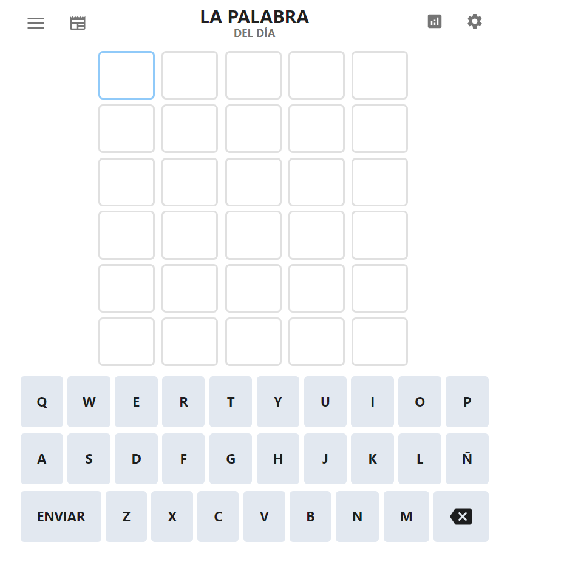

# Delegación de eventos. Wordle

Implementa el juego [Wordle](https://lapalabradeldia.com/)

- Partiendo de un documento html vacío, crea los elementos HTML del Wordle mediante los métodos del objeto predefinido document.
  - Prohibido document.write().
  - Maneja el formato con clases definidas en el `style.css`.
  - Este commit tendrá el mensaje `feat: añade elementos al DOM`
- Utiliza la delegación de eventos para añadirle el comportamiento. Esto significa que añadirás el comportamiento NO A CADA LETRA, sino al contenedor padre de todas ellas. Después, mediante evento.target averiguarás qué letra has usado.
- Implementa el comportamiento con los eventos del ratón. 
- (Opcional) Implementa el comportamiento con los eventos del teclado.
- Utiliza el `removeEventListener` para eliminar el comportamiento una vez finalizada la partida.
- No añadas el comportamiento hasta que no tengas el entorno gráfico bien depurado. Una vez lo tengas, añade el comportamiento en el commit `feat: añade comportamiento clic con delegación de eventos`

De interés
- https://es.javascript.info/event-delegation
- https://ed.team/blog/como-usar-la-delegacion-de-eventos-en-javascript
- https://docs.github.com/en/desktop/contributing-and-collaborating-using-github-desktop/managing-commits/managing-tags#about-tags-in-github-desktop
- https://docs.github.com/en/repositories/releasing-projects-on-github/about-releases
