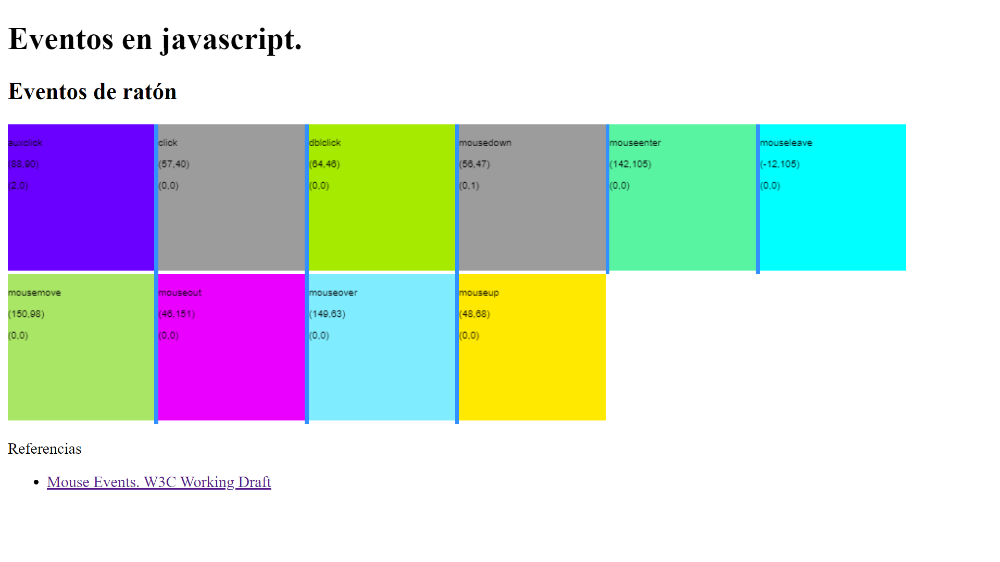
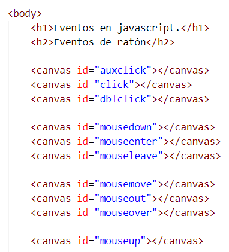

# Eventos de ratón
Crea la siguiente página donde demuestres tu buen hacer con los eventos de ratón

Para ello crea un canvas para cada evento. 

Deben reaccionar cambiando de color. Identifícalo con un texto. En todo momento muestra las coordenadas (x, y), button y buttons.  Recuerda comprobarlo al menos en los navegadores principales.

Eventos de ratón según la [W3C UI Events](https://www.w3.org/TR/uievents/):

1. auxclick
1. click
1. dblclick
1. mousedown
1. mouseenter
1. mouseleave
1. mousemove
1. mouseout
1. mouseover
1. mouseup

   
Recuerda que:

- Debes anular el evento del menú contextual (botón secundario)
- Debes confirmar el cambio de color. Usa el atributo data-color
- Usa .bind() para registrar cada evento
- Usa .bind() para pintar por primera vez en el lienzo del elemento DOM

  
Responde a las siguientes preguntas:
1. Explica los atributos (y sus valores) que tiene el objeto evento para identificar las coordenadas del evento (x, y)
2. Explica los atributos (y sus valores) que tiene el objeto evento para identificar los botones del ratón que intervienen en el evento.

