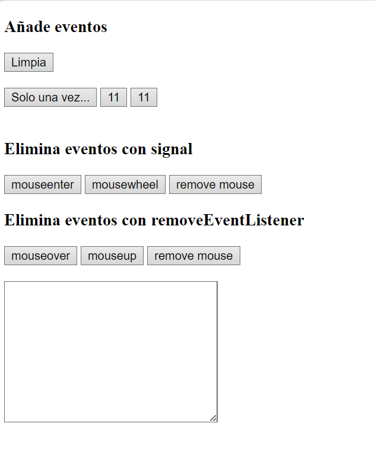
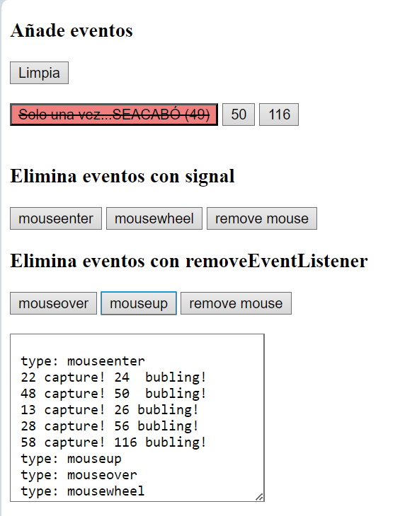

[](https://classroom.github.com/a/FqWAXZtl)
[](https://classroom.github.com/online_ide?assignment_repo_id=13542396&assignment_repo_type=AssignmentRepo)
# Tarea 5.3. Profundizando con eventos (Capturing, bubbling, once, remove, signal...)

Parte de los ficheros que se adjuntan. Añade el código necesario para gestionar los eventos según las instrucciones siguientes.



## Añadiendo eventos
En este apartado trabajarás con los siguientes botones:

- limpia
- solo una vez
- 11 (multiplica y suma)
- 11 (suma y multiplica)
  
Añade el comportamiento en un fichero  `main.js`

### Limpia
Usa el textarea para mostrar qué se hace en cada fase. El botón "limpia" limpiará el textarea.

### Sólo una vez

Al botón "Sólo una vez..." se le asocia el siguiente comportamiento sólo una vez  `{ once: true }`:
- le añade al botón el texto SEACABÓ seguido de los segundos de la hora actual
- aplica la clase pulsado
- utiliza la palabra reservada this para acceder al texto.



### Multiplica y suma
Asocia los eventos al contenedor:
- El botón de tipo multiplica-suma primero multiplica por dos y después suma dos
- Estos serán los resultados (sobre el propio botón):  11 -> 22+2=24    ->   48+2=50     -> 100+2=102
- La multiplicación la hace en la bajada (capturing, useCapture=true) y la suma en la subida (bubling, useCapture=false)

Haz uso de las siguientes funciones:
```js
/**
 * Toma el contenido del target del evento y le suma 2
 * @param {Event} event 
 */
function suma(event) {
    event.target.textContent = Number(event.target.textContent) + 2;
}

/**
 * Toma el contenido del target del evento y le multiplica 2
 * @param {Event} event 
 */
function multiplica(event) {
    event.target.textContent = Number(event.target.textContent) * 2;
}
```

### Suma y multiplica

Asocia los eventos al contenedor:
- El botón de tipo suma-multiplica primero suma dos y después multiplica
- Estos serán los resultados (sobre el propio botón): 11 -> 13*2=26    ->   28*2=56   ->    58*2=116
- La multiplicación la hace en la bajada (capturing, useCapture=true) y la suma en la subida (bubling, useCapture=false)

Reutiliza las  funciones indicadas arriba.

## Eliminando eventos

Hasta ahora, para eliminar los eventos se había usado el método `revomeEventListener`. Este método tiene la particularidad de que sólo se puede eliminar el evento repitiendo EXÁCTAMENTE los mismos parámetros del método donde se asoció `addEventListener`:
- El mismo evento
- El mismo callback
- La misma fase bubbling/capture (useCapture). Si un listener está registrado dos veces, uno en la fase de bubbling (`useCapture == false`) y otro en la de capture (`useCapture == true`), debe eliminarse cada uno por separado. La eliminación de un listener en `bubbling` no afecta a la versión registrada en `capture` del mismo listener, y viceversa.

La alternativa posterior ha sido el uso de AbortSignal: se le pasa a un addEventListener() y se invoca con abort() en el controlador que posee la señal. 

### Elimina eventos con signal
En este apartado trabajarás con los siguientes botones:

- mouseenter
- mousewheel
- remove mouse

Añade el comportamiento en un fichero aparte `remove-event-signal.js`

Añade a los dos botones de la izquierda (coinciden en la class) los eventos que indican. Mostrarán el type del evento en el textarea.
Al pulsar el botón remove mouse se elimina el comportamiento mediante el uso de signal.

### Elimina eventos con removeEventListener

Añade el comportamiento en un fichero aparte `remove-event-listener.js`
En este apartado trabajarás con los siguientes botones/eventos:

- mouseover
- mouseup 
- remove mouse

Añade a los dos botones de la izquierda (coinciden en la class) los eventos que indican. Mostrarán el type del evento en el textarea.
Al pulsar el botón remove mouse se elimina el comportamiento mediante removeEventListener


De interés:
- [example_of_options_usage](https://developer.mozilla.org/en-US/docs/Web/API/EventTarget/addEventListener#)
- [once](https://developer.mozilla.org/en-US/docs/Web/API/EventTarget/addEventListener#once)
- [EventTarget: removeEventListener() method](https://developer.mozilla.org/en-US/docs/Web/API/EventTarget/removeEventListener)
- [Add an abortable listener](https://developer.mozilla.org/en-US/docs/Web/API/EventTarget/addEventListener#add_an_abortable_listener)
